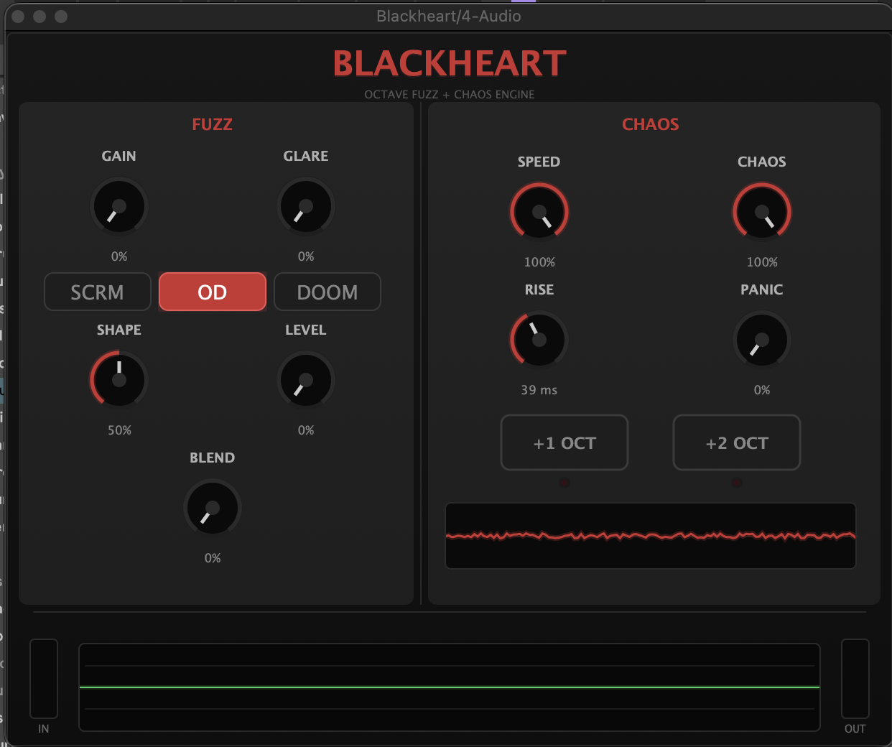

# Blackheart

A JUCE-based VST3 audio effect plugin combining analog-style octave fuzz with chaotic digital pitch-shifting and modulation. Designed for heavy, downtuned guitar and experimental sound design.

## Project Overview

The initial prototype of Blackheart was developed with AI assistance. I am now rewriting all core DSP components from scratch to practice my own signal processing design and implementation skills. This is primarily a learning project to explore DSP concepts and real-time audio processing.

## Features

- **Fuzz Engine** – Analog-style nonlinear waveshaping with three modes (Scream, OD, Doom) and active EQ shaping
- **Octave-Up Generation** – Rectification-based harmonic generation with dynamic gating
- **Pitch Shifting** – Momentary +1 and +2 octave shifts using granular synthesis with variable grain density, window degradation, and feedback
- **Chaos Modulation** – LFO, sample-and-hold, and envelope-responsive modulation with cross-modulation and zero-floor envelope tracking
- **PANIC Detune** – Detuned pitch-bent grain copies for atonal destruction
- **Ring Modulation** – Audio-rate amplitude modulation at high Speed settings for metallic, inharmonic textures
- **Low Latency** – Optimized for real-time performance (<10ms)

## Parameters

| Parameter | Description |
|-----------|-------------|
| Gain | Distortion intensity |
| Glare | Octave-up amount + gate interaction |
| Blend | Dry/wet mix |
| Level | Output level of fuzz block |
| Mode | Fuzz voicing — Scream, OD, Doom |
| Shape | Active EQ sweep |
| Speed | Low: chaos modulation rate. High: ring modulation |
| Chaos | Modulation depth + randomness |
| Rise | Pitch shift attack time |
| Panic | Detuned pitch destruction — subtle chorus to full atonal chaos |
| Octave +1 | Momentary +1 octave pitch shift |
| Octave +2 | Momentary +2 octave pitch shift |

## Building

### Requirements

- [JUCE Framework](https://juce.com/) (v7.x recommended)  
- C++17 compatible compiler  
- CMake 3.15+ or Projucer  

### Build with Projucer

1. Open `Blackheart.jucer` in Projucer  
2. Export to your IDE (Xcode, Visual Studio, etc.)  
3. Build the generated project  

## Acknowledgments

- Initial prototype developed with AI assistance  
- Built using the [JUCE Framework](https://juce.com/)  

## License

AGPLv3 (Same license that JUCE uses for Open Source projects)
